# How to create and host a Minecraft server?

+ **THIS GUIDE IS FOR WINDOWS OPERATING SYSTEM ONLY!**
+ **THIS GUIDE IS FOR MINECRAFT: JAVA EDITION ONLY!**

Minecraft is one of the most popular games worldwide. While the block-building and survival game is fun to play by yourself, it's even more fun to play with other people. Minecraft: Java Edition allows you to host your own server using your own computer. It does require some basic computer knowledge and networking skills. This will teaches you how to setup and host your own server on your computer.

If you want to support me you can [buy me a coffee](https://www.buymeacoffee.com/gamertilen)! ☕

### **Notes and warnings:**

> [!WARNING]
> Before you try to do any of this at home, these instructions are meant for parents who are helping their kids. Kids MUST get parent permission and choose a time when they can supervise and help. Setting up and running an online server means that anyone with your external IP address will be able to join your server and play in your Minecraft world. Think carefully about who you invite to play on your server!

> [!IMPORTANT]
> This guide shows you how to set up and configure a Minecraft Server. However, doing this requires changing your home network's configuration and is not recommended unless you know what you are doing. If you wish to purchase a small private server for friends, check out [Minecraft Realms](<https://www.minecraft.net/realms>). If you still wish to set up your own private server, do so at your own risk.

> [!NOTE]
> This server setup is only compatible with **Minecraft: Java Edition**. This guide is only for operating platform **Windows**.

### **Help & support:**

**Need help troubleshooting?**  Refer to the [Minecraft online server set up Wiki article](https://minecraft.fandom.com/wiki/Tutorials/Setting_up_a_server). *Please note: Some solutions to server issues require adjusting critical settings on your computer. If this is done improperly, you can damage your computer.*

**Need help?** You can join our Discord server and we will help you. Join here: [https://discord.gg/TDYTVWjubN](https://discord.gg/TDYTVWjubN).

**Have a question?** You can ask it in [discussions](https://github.com/GamerTilen/CreateMinecraftServer/discussions).

## Step by step guide

### 1. Install the Latest Version of Java
Since Minecraft is a Java-based game, our first step is to make sure you have the latest version of Java installed. If you don't, [download Java here](https://www.java.com/download/).

### 2. Download Minecraft_Server.jar

Next, you'll need the server files. You can get these for free from the official Minecraft site:
 
1. Go to the Minecraft Server Downloads page and download `minecraft_server.1.20.2.jar`.
2. Once the download finishes, copy `minecraft_server.1.20.2.jar` into a new folder on your desktop and call this folder "Minecraft Server" (you can name the folder however you want we just used "Minecraft Server" as an example).

> [!NOTE]
> File `minecraft_server.1.20.2.jar` can also be named `server.jar`. If this happend just reneme it or you can leave if like that. But somethink in the following steps must be changes if you leave it like that. [^1]
[^1]:When you are pasting the line into Notepad (step 3) you must change the `minecraft_server.1.20.2.jar` to the name you chosen. But leave the **.jar** in!
> [!NOTE]
> Minecraft will over time be update so the file name can be changed. I will try to update it when it changes.

### 3. Create a Batch File to Run the Server 

1. Right-click inside the Server folder where you put the `Minecraft_Server.1.20.2.jar`.
2. Select **New** > **Text Document**.
3. Name the new document **Run**.
4. Inside the Notepad document, paste the following line: `java -Xmx1024M -Xms1024M -jar minecraft_server.1.20.2.jar nogui pause`.

> [!IMPORTANT]
> If you're using a different name for the file, change `minecraft_server.1.20.2.jar` part, to the name you're using. 

5. Now **Save As** a batch file, which is a file Windows uses to run command line commands. 
6. Click **File** > **Save As**.
7. In the field **Save as Type**, select **All Files**.
8. Set the file name to **Run.bat**. 

> [!IMPORTANT]
> Make sure you remove the **.txt** at the end of the filename.

9. Now run the file. When you did that a batch file will open and some new files will be created. If that doesn't happend get [support above](https://github.com/GamerTilen/CreateMinecraftServer/tree/CreateMinecraftServer(main)#help--support).

### 4. Agree to the EULA

After you did the last step you will see a license agreement provided that you must agree to before launching a Minecraft server. You'll need to edit the file `eula.txt` to indicate that you agree.

1. Double-click `eula.txt`. 
2. Change the line **eula=false** to **eula=true**.

> [!NOTE]
> You can [read the EULA here](https://www.minecraft.net/en-us/eula) or by copying and pasting the link from the file. 

### 5. Start the Server

> [!IMPORTANT]
> This is NOT the finished server because you can only access it on your computer/network. You must do all the steps to have a server that everyone can join.

Now you're ready to start your server! 
Double-click `Run.bat` and your server will launch.
A window will appear with some info about your server. As long as you leave this window open, your server is running! 

> [!IMPORTANT]
> If the command prompt opens close it and click on `minecraft_server.1.20.2.jar` and the right window will open but if an error pops up [please get support above](https://github.com/GamerTilen/CreateMinecraftServer/tree/CreateMinecraftServer(main)#help--support))

#### The server window (server console)

Your server provides some information to help you keep track of what's going on, even if you're not in-game. 

1. You can see how much memory the server is using in the Stats panel. 
2. You can check who is currently connected to the server in the Players panel.
3. You can see server messages and player chats in the Log and Chat panel. 
4. You can use the field on the bottom-right to enter server commands.

To make a Minecraft server visible publicly, you will need to find the default server port, allow it through a firewall, and tinker with your router configuration.

Server Commands allow advanced users more control over their server. You can find a list of all possible commands [here](https://minecraft.fandom.com/wiki/Commands).

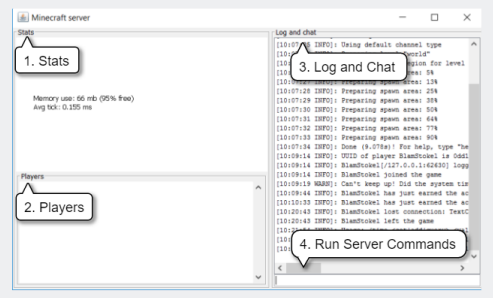

### 6. Port Forwarding

To make a Minecraft server visible publicly, you will need to find the default server port, allow it through a firewall, and tinker with your router configuration.

#### Step 1: Set the Port on Minecraft Configuration

1. Open the Minecraft server directory and locate the `server.properties` file.

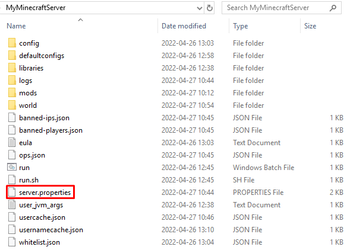
   
3. Right-click on it and open the file with a text editor.

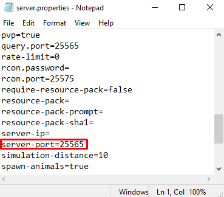

4. Find the **server-port** line.

Here is the default port number for Minecraft: Java edition: **25565**

Users can change the port by changing the server-port value to any in the range from **1** to **65535**, although I recommend sticking with the default one.

#### Step 2: Allow the Port on Your Firewall

To ensure that the server works correctly, you will need to allow the Minecraft port number via your firewall.

1. Open **Windows Defender Firewall with Advanced Security**.

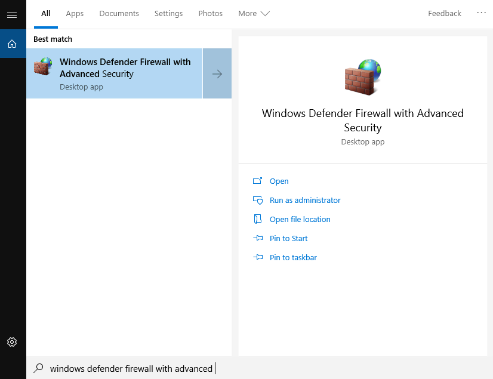

2. Click on **Inbound Rules** and select **New Rule**.

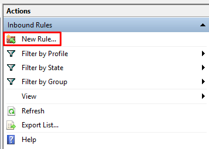

3. Choose **Port** and click **Next**.

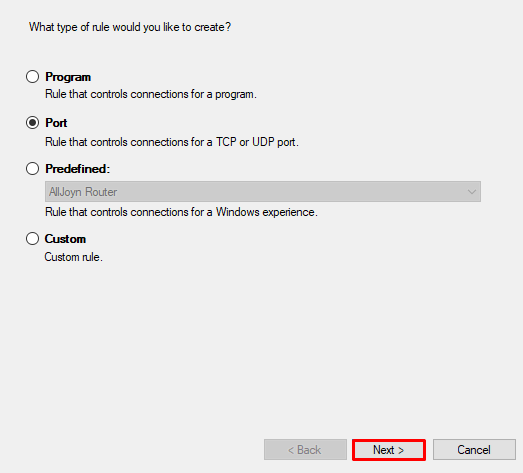

4. Select **TCP**, and enter the Minecraft port number. In this case, it’s **25565**. Once done, click **Next**.

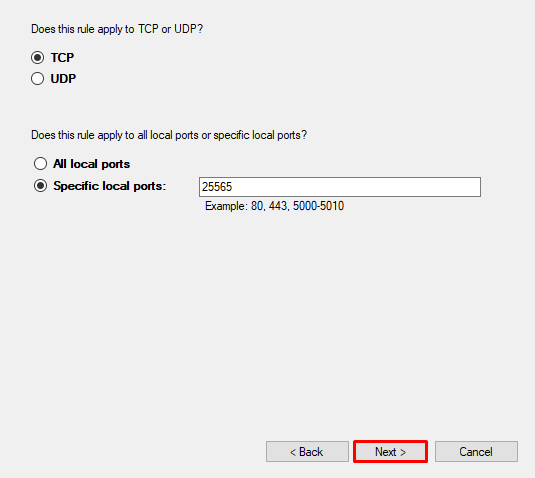

5. Select **Allow connection** and click the **Next** button until the final step. Before clicking **Finish**, give your rule a name.

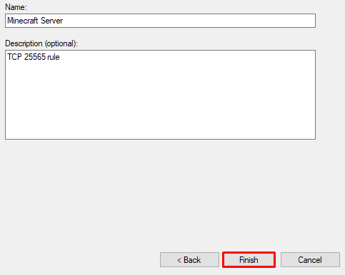

6. After you have created the rule, make a new one with the same configuration, just for **UDP**

#### Step 3: Forward the Port on the Router

With the firewall set up and incoming network requests allowed, proceed to create a port forward rule on your router. Even though each router has a different interface, the steps will be similar.

 For short this are the following steps:
 - Find your **default gateway** IP address. It will be used to log in to the router.
 - Set up a static IP address.
 - Open the port forwarding settings.
 - Specify which TCP and UDP ports to forward.

##### 1. Finding the Router Address and Setting up a Static IP on Windows

1. Press **Windows** + **R** and enter **CMD** to open the command prompt.
2. Run the following command: `ipconfig`.
3. The router’s IP address will be shown on the **Default gateway** line.

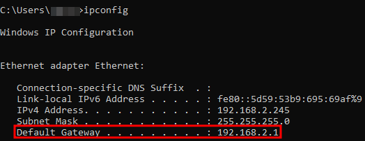

4. To set up a static IP address, press **Windows** + **R** again and enter **ncpa.cpl**. Right-click your network interface, select **Properties**, **locate Internet Protocol Version 4 (TCP/IP)**, and select **Properties** again.

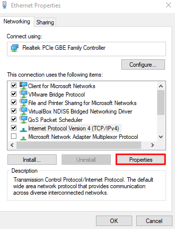

5. Specify the preferred static IP address (IPv4 address in command prompt), subnet mask (255.255.255.0), and the router IP you acquired earlier (deafult gateaway in command prompt).

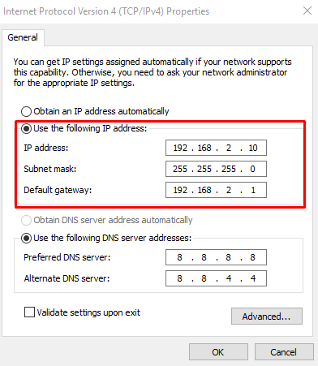

6. Once done, click **OK** to save the changes.

##### 2. Logging in to the Router

1. Paste the router IP address into your browser’s address bar and press **Enter**. A login page will appear.

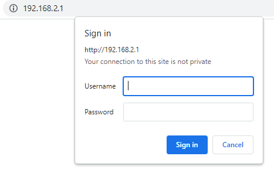

2. It will ask for a username and password. If you are unsure where to find them, check the stickers on your router. Another option is to Google the router’s name and model number along with keywords like default login credentials.
3. Once logged in, look for options related to **virtual server** or **port forwarding**. In this tutorial, we’ll use a D-Link router. Its interface for port forwarding looks like this:

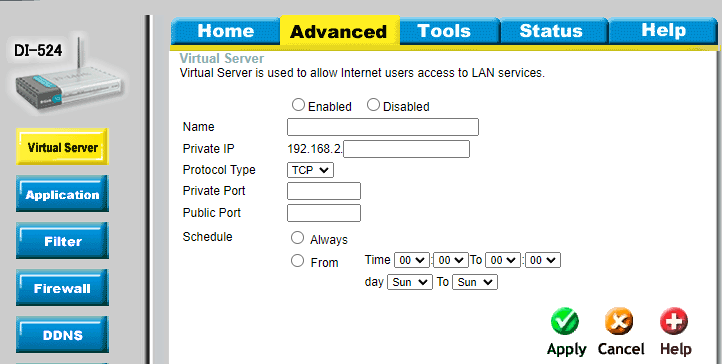

4. Check the **Enabled option**, give the forwarding rule a name, specify the local static IP address you’ve set previously, and enter the Minecraft server port. In this case, it’s 25565. Don’t forget to apply the configuration for both TCP and UDP ports.

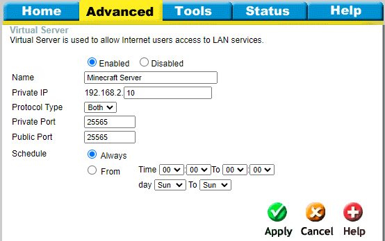

5. Once done, save the changes.

> [!NOTE]
> If you are still unsure about the exact port forwarding procedure for your specific router, you can always Google the device name and look up the router’s manual.

#### Step 4: Get the Server Public IP address and play

> [!IMPORTANT]
> If you had server running in the forwarding procees you will need to restart it so changes can apply.

1. Find out your public IP address (IPv4) [here](https://whatismyipaddress.com/).
3. Now players will be able to join the server via that IP.

> [!NOTE]
> Keep in mind that if the default server port 25565 was changed, users would need to connect using the **`IP:port`** syntax (the **`port`** part must be replaced with your port and the **`IP`** part must be replaced with your public IP but you need to keep **`:`** beetween them). 

## Congratulations! You have just created a Minecraft server!

And that's it! Remember, always ask parents for permission before starting to set up an online server! And importantly, you must download the server software from Minecraft and use port forwarding to allow others access to your server.

***Try this!*** Don't forget that you can double-check steps and get more information on setting up servers here:
+ [https://help.minecraft.net/hc/en-us/articles/360058525452-How-to-Setup-a-Minecraft-Java-Edition-Server](https://help.minecraft.net/hc/en-us/articles/360058525452-How-to-Setup-a-Minecraft-Java-Edition-Server)
+ [https://minecraft.fandom.com/wiki/Tutorials/Setting_up_a_server](https://minecraft.fandom.com/wiki/Tutorials/Setting_up_a_server)
